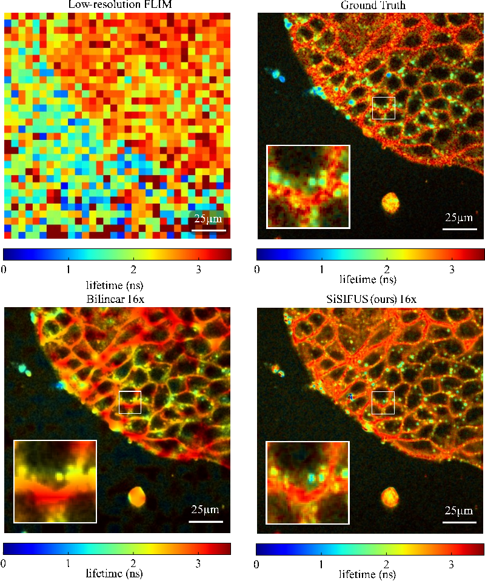

# SiSIFUS
### Single-sample image-fusion upsampling of fluorescence lifetime images

We present single-sample image-fusion upsampling, a training-set-free computational single-image super-resolution method.

Unlike typical example-based super-resolution techniques (such as neighbor embedding or deep learning), our method draws all information from a single measurement; we have no external training set, and thus no external training bias. Nonetheless, our method can draw more information about lifetime than the low-resolution image natively contains by exploiting dependencies between it, and our high-resolution intensity measurement. We explain in detail the nature of these dependencies and how we exploit them using both local and global priors. Beyond the aesthetics of the images, SiSIFUS therefore represents a paradigm shift in the methodology of how image upsampling is performed for a number of important reasons:

1) Upsampling is achieved by convex optimization based on the physical forward model of how the data is captured, including details of the camera

2) The convex optimization is constrained by a prior that is built by searching for physical and physiological correlations between the low-resolution lifetime image (that we want to upsample) and a high-resolution CMOS image. Therefore, the final upsampled image is built upon actual new information (as opposed to bilinear interpolation techniques that do not add new information to the final image). 

3) SiSIFUS uses machine learning to build the prior but uses only data from the two raw images and does not require any additional data or large datasets. This is possibly the most important aspect of our approach and where we believe we have a true paradigm change. In most approaches (in all domains that we are aware of, not just bio-imaging) the training data sets are “external” to the actual individual measurement or image that is being upsampled. This leads to significant issues - most importantly, features will appear in the final image that are inferred from the training data set but that are not actually part or present anywhere in the real sample. This form of “hallucination” is a well-known obstacle in the uptake of machine learned methods in biological and medical imaging. Here, we present a novel approach to training-set-free super-resolution of a single image, using unique advantages that data fusion can offer. 

Unlike typical example-based super-resolution techniques (such as neighbor embedding or deep learning), our method draws all information from a single measurement; we have no external training set, and thus no external training bias. Nonetheless, our method can draw more information about lifetime than the low-resolution image natively contains by exploiting dependencies between it, and our high-resolution intensity measurement. We explain in detail the nature of these dependencies and how we exploit them using both local and global priors.

Beyond the aesthetics of the images, SiSIFUS therefore represents a paradigm shift in the methodology of how image upsampling is performed for a number of important reasons:

1) Upsampling is achieved by convex optimization based on the physical forward model of how the data is captured, including details of the camera

2) The convex optimization is constrained by a prior that is built by searching for physical and physiological correlations between the low-resolution lifetime image (that we want to upsample) and a high-resolution CMOS image. Therefore, the final upsampled image is built upon actual new information (as opposed to bilinear interpolation techniques that do not add new information to the final image). 

3) SiSIFUS uses machine learning to build the prior but uses only data from the two raw images and does not require any additional data or large datasets. This is possibly the most important aspect of our approach and where we believe we have a true paradigm change. In most approaches (in all domains that we are aware of, not just bio-imaging) the training data sets are “external” to the actual individual measurement or image that is being upsampled. This leads to significant issues - most importantly, features will appear in the final image that are inferred from the training data set but that are not actually part or present anywhere in the real sample. This form of “hallucination” is a well-known obstacle in the uptake of machine learned methods in biological and medical imaging. Here, we present a novel approach to training-set-free super-resolution of a single image, using unique advantages that data fusion can offer. 
